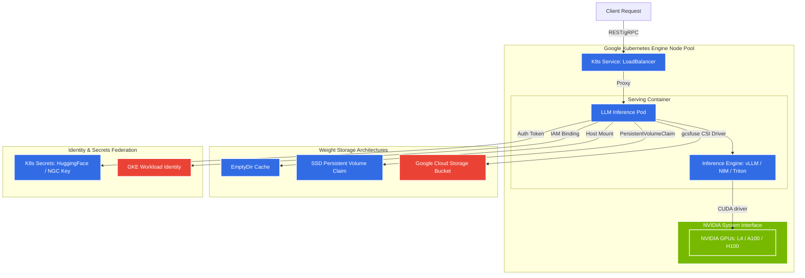

# GKE Deployment Generator for Nemotron & LLMs

An advanced interactive configuration architect for generating production-ready Google Kubernetes Engine (GKE) deployments carrying Nemotron-3 and other LLM parameters. This interface assists infrastructure engineers and AI platform developers in automating the generation of optimized Kubernetes manifests, storage claims, and hardware configurations for NVIDIA GPU acceleration.

---

## 🏛️ GKE Deployment Architecture

The generated manifests orchestrate an industry-standard, cloud-native architecture optimized for serving heavy weights on GKE with clean separation of concerns:

```
                                      [ INGRESS TRF ]
                                             │
                                             ▼
                                  ┌──────────────────────┐
                                  │   Kubernetes Service │
                                  │ (LoadBalancer/Cluster)│
                                  └──────────┬───────────┘
                                             │ (Port 8000/80)
                                             ▼
                               ┌───────────────────────────┐
                               │ Kubernetes Namespace      │
                               │                           │
                               │  ┌─────────────────────┐  │   ┌───────────────────────┐
                               │  │  Inference Pod(s)   │  │   │  Hugging Face / NGC   │
                               │  │                     ◄──┼───┤   Security Secrets    │
                               │  │ ┌─────────────────┐ │  │   │   (K8s Secret Refs)   │
                               │  │ │ Serving Engine │ │  │   └───────────────────────┘
                               │  │ │ (vLLM/NIM/Trtn)│ │  │
                               │  │ └────────┬────────┘ │  │   ┌───────────────────────┐
                               │  │          │          │  │   │   Workload Identity   │
                               │  │ ┌────────▼────────┐ │  │   │   ServiceAccount      │
                               │  │ │ CUDA / Driver   │ │  ├───►    (GCP IAM Bind)     │
                               │  │ └────────┬────────┘ │  │   └───────────────────────┘
                               │  │          │          │  │
                               │  │ ┌────────▼────────┐ │  │
                               │  │ │ Accelerator(s)  │ │  │
                               │  │ │ (L4, A100, H100)│ │  │
                               │  │ └─────────────────┘ │  │
                               │  └──────────┬──────────┘  │
                               │             │ (Mount Paths)
                               └─────────────┼─────────────┘
                                             │
                   ┌─────────────────────────┼─────────────────────────┐
                   ▼                         ▼                         ▼
         ┌──────────────────┐      ┌──────────────────┐      ┌──────────────────┐
         │     EmptyDir     │      │  Persistent SSD  │      │  GCS FUSE Mount  │
         │ Ephemeral Storage│      │  (premium-rwo)   │      │ Cloud Storage CSI│
         └──────────────────┘      └──────────────────┘      └──────────────────┘
```

### 🧬 Logical Infrastructure Topology (Mermaid)



---

## ✨ Key System Capabilities

*   **⚡ Automated Hardware Suitability Calculations**: Computes the sizing requirements for official Nemotron-3 weight parameters (or parameterized Custom Models from Hugging Face). Proactively monitors VRAM margins against selected GPU configurations (`NVIDIA L4`, `A100-40GB`, `A100-80GB`, `H100-80GB`, `T4`) and flashes diagnostic out-of-memory warnings prior to manifests compilation.
*   **🧩 Multi-Serving Framework Engines**: Generates tailor-made deployments running:
    *   **vLLM**: Configures optimized OpenAPI-compliant engines featuring dynamic PagedAttention arrays and continuous batching.
    *   **NVIDIA NIM**: Embeds TensorRT-LLM container structures directly tied to high-speed NVIDIA registries with NGC validation parameters.
    *   **Triton Inference Server**: Maps versatile concurrent model processing and multi-instance orchestration.
*   **💾 Enterprise Dynamic Storage Specs**:
    *   **Ephemeral Cache**: Configures cost-efficient local memory caches on high-throughput node volumes via `emptyDir` setups.
    *   **Solid-State Storage**: Provisions high-performance SSD block stores utilizing cloud storage classes (`premium-rwo` claims).
    *   **Cloud Object Storage**: Mounts scalable cloud filesystems globally via GCS-FUSE mounts through GCP CSI plugins.
*   **🔒 Security & Identity Best Practices**: Implements Google Workload Identity annotations mapping cluster ServiceAccounts to GCP IAM primitives, alongside secret ingestion keys for private registries.

---

## 🛠️ Usage Flow & Operations

1.  **Select Your Architecture Targets**: Point the interface to your desired target model, serving framework, cluster category (Autopilot / Standard GKE), and security levels.
2.  **Evaluate Hardware Feasibility**: Check the interactive **Hardware Feasibility & VRAM Gauges** widget, which assesses the exact weight capacity margin. If resources are insufficient, scale the **GPU Accelerator counts** (1x, 2x, 4x, or 8x) to configure proper Tensor Parallelism.
3.  **Deploy Blueprint Artifacts**: Access the **Deployment Blueprints** panel to fetch the generated files:
    *   📁 `deployment.yaml`: Fully configured Kubernetes Deployment manifest containing NodeSelectors, GPU resource quotas, volume-mount structures, and readiness/liveness checks.
    *   📁 `service.yaml`: Cluster routing specifications matching LoadBalancer or internal ClusterIP bindings.
    *   📁 `storage.yaml`: High-speed block storage definitions (PersistentVolume / PVC annotations).
    *   📁 `security.yaml`: Secret bindings for API credentials and Workload Identity maps.

---

## 🚀 Getting Started (Run Generator Locally)

### Prerequisites

*   **Node.js** (v18 or higher)
*   **npm** (Node Package Manager)

### Installation & Run

1.  **Install dependencies**:
    ```bash
    npm install
    ```

2.  **Set Environment Variables**:
    Create a local configuration file named `.env.local` inside the root directory and declare your database config or platform credentials (such as Google Gemini API keys for the deployment consultant assistant):
    ```env
    GEMINI_API_KEY=your_gemini_api_key_goes_here
    ```

3.  **Boot the local dev server**:
    ```bash
    npm run dev
    ```
    Open [http://localhost:3000](http://localhost:3000) in your web browser to access the graphical deployment planner.

---

## 📑 Production Manifest Best Practices

When applying the generated configurations, adhere to the following cloud hygiene checklists:

1.  **Enable the GCP GPU Drivers Plugin**: GKE Autopilot installs drivers automatically. If you chose a **Standard Node Pool**, ensure you have applied the NVIDIA kernel driver manifest:
    ```bash
    kubectl apply -f https://raw.githubusercontent.com/GoogleCloudPlatform/container-engine-accelerators/master/nvidia-driver-installer/cos/daemonset-preloaded.yaml
    ```
2.  **Ensure Workload Identity is Configured**: For setups depending on GCS FUSE integration, the cluster must support Workload Identity:
    ```bash
    gcloud container clusters update <cluster-name> \
        --region=<gcp-region> \
        --workload-pool=<project-id>.svc.id.goog
    ```
3.  **Allocate Secret Key References**: Make sure authentication tokens (like HuggingFace access parameters and NGC API registries) match target security manifests within your dedicated namespace.

---

## ⚖️ License

Distributed under the Apache 2.0 License. See `LICENSE` for more information.
