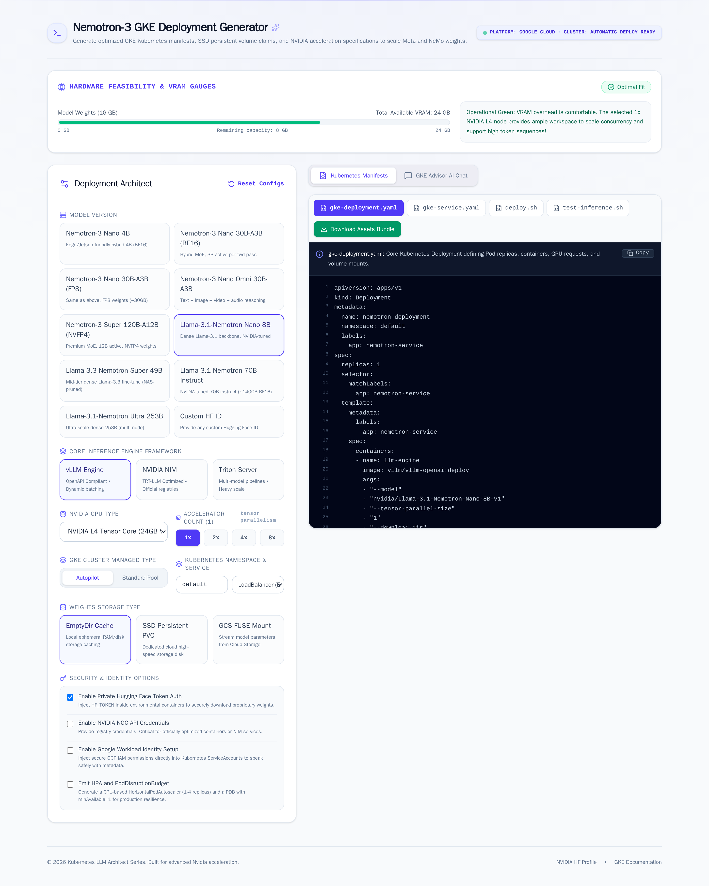
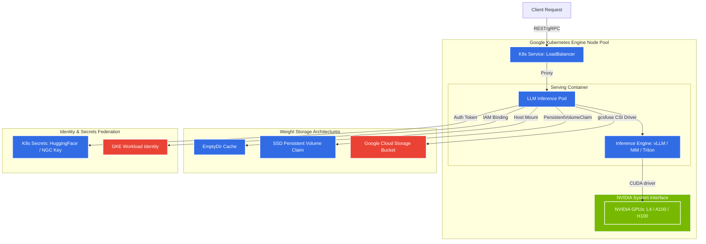

# GKE Deployment Generator for Nemotron & LLMs

An interactive configuration UI that generates starter Google Kubernetes Engine (GKE) manifests for serving NVIDIA Nemotron-3 (and related Llama-3.1-Nemotron) models. Pick a model, a serving framework (vLLM / NIM / Triton), GPU class, storage backend, and identity options; the app emits a Deployment, Service, optional PVC, ServiceAccount, HPA + PDB, and a `deploy.sh` that wires it all together. **Treat the output as a reviewed starting point, not as production-ready as-is** — see _Limitations_ below.



---

## 🏛️ GKE Deployment Architecture

The generated manifests orchestrate an industry-standard, cloud-native architecture optimized for serving heavy weights on GKE with clean separation of concerns:

```
                                      [ INGRESS TRF ]
                                             │
                                             ▼
                                  ┌──────────────────────┐
                                  │   Kubernetes Service │
                                  │ (LoadBalancer/Cluster)│
                                  └──────────┬───────────┘
                                             │ (Port 8000/80)
                                             ▼
                               ┌───────────────────────────┐
                               │ Kubernetes Namespace      │
                               │                           │
                               │  ┌─────────────────────┐  │   ┌───────────────────────┐
                               │  │  Inference Pod(s)   │  │   │  Hugging Face / NGC   │
                               │  │                     ◄──┼───┤   Security Secrets    │
                               │  │ ┌─────────────────┐ │  │   │   (K8s Secret Refs)   │
                               │  │ │ Serving Engine │ │  │   └───────────────────────┘
                               │  │ │ (vLLM/NIM/Trtn)│ │  │
                               │  │ └────────┬────────┘ │  │   ┌───────────────────────┐
                               │  │          │          │  │   │   Workload Identity   │
                               │  │ ┌────────▼────────┐ │  │   │   ServiceAccount      │
                               │  │ │ CUDA / Driver   │ │  ├───►    (GCP IAM Bind)     │
                               │  │ └────────┬────────┘ │  │   └───────────────────────┘
                               │  │          │          │  │
                               │  │ ┌────────▼────────┐ │  │
                               │  │ │ Accelerator(s)  │ │  │
                               │  │ │ (L4, A100, H100)│ │  │
                               │  │ └─────────────────┘ │  │
                               │  └──────────┬──────────┘  │
                               │             │ (Mount Paths)
                               └─────────────┼─────────────┘
                                             │
                   ┌─────────────────────────┼─────────────────────────┐
                   ▼                         ▼                         ▼
         ┌──────────────────┐      ┌──────────────────┐      ┌──────────────────┐
         │     EmptyDir     │      │  Persistent SSD  │      │  GCS FUSE Mount  │
         │ Ephemeral Storage│      │  (premium-rwo)   │      │ Cloud Storage CSI│
         └──────────────────┘      └──────────────────┘      └──────────────────┘
```

### 🧬 Logical Infrastructure Topology (Mermaid)



---

## ✨ Key System Capabilities

*   **⚡ Automated Hardware Suitability Calculations**: Computes the sizing requirements for official Nemotron-3 weight parameters (or parameterized Custom Models from Hugging Face). Proactively monitors VRAM margins against selected GPU configurations (`NVIDIA L4`, `A100-40GB`, `A100-80GB`, `H100-80GB`, `T4`) and flashes diagnostic out-of-memory warnings prior to manifests compilation.
*   **🧩 Multi-Serving Framework Engines**: Generates tailor-made deployments running:
    *   **vLLM**: Configures optimized OpenAPI-compliant engines featuring dynamic PagedAttention arrays and continuous batching.
    *   **NVIDIA NIM**: Embeds TensorRT-LLM container structures directly tied to high-speed NVIDIA registries with NGC validation parameters.
    *   **Triton Inference Server**: Maps versatile concurrent model processing and multi-instance orchestration.
*   **💾 Enterprise Dynamic Storage Specs**:
    *   **Ephemeral Cache**: Configures cost-efficient local memory caches on high-throughput node volumes via `emptyDir` setups.
    *   **Solid-State Storage**: Provisions high-performance SSD block stores utilizing cloud storage classes (`premium-rwo` claims).
    *   **Cloud Object Storage**: Mounts scalable cloud filesystems globally via GCS-FUSE mounts through GCP CSI plugins.
*   **🔒 Security & Identity Best Practices**: Implements Google Workload Identity annotations mapping cluster ServiceAccounts to GCP IAM primitives, alongside secret ingestion keys for private registries.

---

## 🛠️ Usage Flow & Operations

1.  **Select Your Architecture Targets**: Point the interface to your desired target model, serving framework, cluster category (Autopilot / Standard GKE), and security levels.
2.  **Evaluate Hardware Feasibility**: Check the interactive **Hardware Feasibility & VRAM Gauges** widget, which assesses the exact weight capacity margin. If resources are insufficient, scale the **GPU Accelerator counts** (1x, 2x, 4x, or 8x) to configure proper Tensor Parallelism.
3.  **Deploy Blueprint Artifacts**: Access the **Deployment Blueprints** panel to fetch the generated files:
    *   📁 `gke-deployment.yaml`: Kubernetes Deployment with `serviceAccountName`, GPU resource requests, volume mounts, and per-SKU CPU/memory sized to the chosen machine type minus daemonset headroom.
    *   📁 `gke-service.yaml`: ClusterIP or LoadBalancer Service exposing the OpenAI-compatible endpoint (port 8000) and, for Triton, the gRPC + metrics ports.
    *   📁 `gke-pvc.yaml` _(when storage = SSD)_: PersistentVolumeClaim against the `premium-rwo` storage class.
    *   📁 `gke-serviceaccount.yaml` _(when Workload Identity or GCS-FUSE is on)_: KSA annotated with the GSA email that `deploy.sh` creates and binds.
    *   📁 `gke-hpa.yaml` + `gke-pdb.yaml` _(when scaling is on)_: HorizontalPodAutoscaler (CPU-based, with a commented-out GPU duty-cycle alternative) and a PodDisruptionBudget with `minAvailable: 1`.
    *   📁 `deploy.sh`: gcloud + kubectl pipeline that creates the cluster/node-pool, the GSA + workloadIdentityUser binding, the `nemotron-secrets` Secret (via `kubectl create secret`, not a YAML file), and applies the manifests.
    *   📁 `test-inference.sh`: cURL smoke test against the deployed endpoint.

---

## 🚀 Getting Started (Run Generator Locally)

### Prerequisites

*   **Node.js** (v18 or higher)
*   **npm** (Node Package Manager)

### Installation & Run

1.  **Install dependencies**:
    ```bash
    npm install
    ```

2.  **Set Environment Variables**:
    Create a local configuration file named `.env.local` inside the root directory and declare your database config or platform credentials (such as Google Gemini API keys for the deployment consultant assistant):
    ```env
    GEMINI_API_KEY=your_gemini_api_key_goes_here
    ```

3.  **Boot the local dev server**:
    ```bash
    npm run dev
    ```
    Open [http://localhost:3000](http://localhost:3000) in your web browser to access the graphical deployment planner.

---

## 📑 Production Manifest Best Practices

When applying the generated configurations, adhere to the following cloud hygiene checklists:

1.  **Enable the GCP GPU Drivers Plugin**: GKE Autopilot installs drivers automatically. If you chose a **Standard Node Pool**, ensure you have applied the NVIDIA kernel driver manifest:
    ```bash
    kubectl apply -f https://raw.githubusercontent.com/GoogleCloudPlatform/container-engine-accelerators/master/nvidia-driver-installer/cos/daemonset-preloaded.yaml
    ```
2.  **Ensure Workload Identity is Configured**: For setups depending on GCS FUSE integration, the cluster must support Workload Identity:
    ```bash
    gcloud container clusters update <cluster-name> \
        --region=<gcp-region> \
        --workload-pool=<project-id>.svc.id.goog
    ```
3.  **Allocate Secret Key References**: Make sure authentication tokens (like HuggingFace access parameters and NGC API registries) match target security manifests within your dedicated namespace.

---

## ⚠️ Limitations

The generator is a fast-start scaffold, not a finished production deployment. Before applying to a real cluster, plan for:

- **NIM coverage is partial.** Seven Nemotron / Llama-Nemotron variants currently map to verified `nvcr.io/nim/...` containers: `llama-3.1-nemotron-nano-8b-v1`, `llama-3.3-nemotron-super-49b-v1`, `llama-3.1-nemotron-70b-instruct`, `nemotron-3-nano` (covers the BF16 + FP8 30B-A3B variants via internal NIM profiles), `nemotron-3-nano-omni-30b-a3b-reasoning`, and `nemotron-3-super-120b-a12b`. Models without a published NIM (Nemotron-3 Nano 4B, Llama-Nemotron Ultra 253B) render a `# WARNING:` placeholder in the manifest and the UI surfaces an amber banner — switch to vLLM or Triton, or supply your own image. New container paths land in `NIM_CATALOG` in `src/utils/generators.ts`.
- **VRAM math is heuristic.** `2 × params` for BF16, `1 × params` for FP8, `0.5 × params` for NVFP4. Real consumption depends on KV-cache size, batch limits, and quantization scheme; verify before committing to a GPU count.
- **Manifests are starters.** Per-framework `startupProbe` / `readinessProbe` / `livenessProbe` are emitted (vLLM `/health`, Triton `/v2/health/{ready,live}`, NIM `/v1/health/{ready,live}`) with a 30-minute startup grace for cold weight loads. What's still missing: HPA tuning, PriorityClass, GPU sharing / MIG, multi-replica weight sharing. The default HPA targets CPU utilization (not GPU duty-cycle, which would need the Custom Metrics Stackdriver Adapter) — sample external-metric block is commented in `gke-hpa.yaml`.
- **Standard-cluster paths need extra prep handled by `deploy.sh`.** When `gkeType=standard`, the script adds `--addons=GcsFuseCsiDriver` to the cluster create when GCS-FUSE is selected, and applies the NVIDIA COS driver DaemonSet so GPU pods can actually schedule. Autopilot handles both automatically.
- **NIM workloads get two secrets.** `deploy.sh` creates both the env-var Secret (`nemotron-secrets`) and the docker-registry pull secret (`nvcr-pull-secret`) under `nvcr.io` — both required, or NIM pods `ErrImagePull` even with the NGC key in the env-var Secret.
- **Placeholders must be filled.** `deploy.sh` ships `PROJECT_ID="YOUR_GCP_PROJECT_ID"` and the secret-create step uses `YOUR_HF_TOKEN_HERE` / `YOUR_NVIDIA_NGC_API_KEY_HERE` (the latter in two places when serving NIM). The KSA manifest references `nemotron-gsa@YOUR_PROJECT_ID.iam.gserviceaccount.com`; the script stamps the real project ID in via `sed` before applying.
- **Gemini chat advisor needs `GEMINI_API_KEY`.** Without it, `/api/chat` returns 500. The endpoint enforces an origin allowlist (`ALLOWED_ORIGINS`, defaults to localhost) and a per-IP rate limit (`RATE_LIMIT_PER_MINUTE`, default 20/min).

---

## 🧪 Verification

The generator output is offline-validated against the Kubernetes OpenAPI schema:

```bash
npm install
node --import tsx scripts/render-fixtures.ts
```

`scripts/render-fixtures.ts` calls `generateAllFiles` for 8 representative `(model × framework × storage × WI × scaling)` combinations covering the full branch matrix, writes the YAML to `/tmp/kubeconform-fixtures/`, and pipes each set through `kubeconform -summary -strict -ignore-missing-schemas`. Current matrix: 8 fixtures, 25 K8s resources, all valid. Add a new combo as a fixture entry if you're testing an untested branch.

For deeper validation against a real cluster's admission controllers + CRDs, `kubectl apply --dry-run=server -f <combo-dir>` against a live GKE cluster is the next step up; offline schema validation alone won't catch GKE-specific policy.

The screenshot at the top of this README is regenerated by `scripts/screenshot.mjs` (Playwright). Easiest way to re-run it after a UI change, given local browser dependencies vary by host, is via the official Playwright Docker image:

```bash
docker run --rm -v "$(pwd)":/work -w /work --network host \
  mcr.microsoft.com/playwright:v1.60.0-jammy bash -c '
    node --import tsx server.ts > /tmp/dev.log 2>&1 &
    for i in {1..30}; do sleep 1; curl -sf http://127.0.0.1:3000/ >/dev/null 2>&1 && break; done
    node scripts/screenshot.mjs
    kill %1
  '
```

---

## ⚖️ License

Distributed under the Apache 2.0 License. See `LICENSE` for more information.
